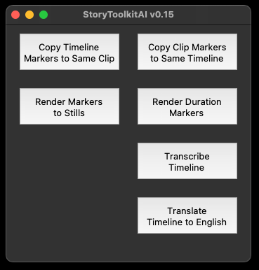

# StoryToolkitAI

## Description

This is meant as an editing extension for Davinci Resolve. 

Among other things, it transcribes timelines directly from Resolve by rendering to Audio Only (mp4/wav) and then passing the rendered file to OpenAI Whisper, a state of the art speech recognition model. 

After the audio files are processed, the tool saves the transcription into both a detailed JSON and an SRT file ready to be imported in Davinci Resolve (or other software).

### Is it really completely free?
Yes, the tool runs locally and there's no need for any additional account.

### Results
The results we get with Whisper are significantly better than any other Speech-to-Text model (including Google, AWS etc.) out there and the models are free to use.

### Speed
Our tests show that on an Macbook Pro M1 a 30 second timeline is transcribed on average in approx. 1 minute, but results may vary.

On a GPU with CUDA the transcription process will be significantly faster. For eg. Whisper Demo Notebooks running Google Collab GPUs transcribe minutes of audio in 10 seconds or less.

---

## Setup

Our installation is on MacOS 12.6 running on M1, but the scripts should run fine on other CPU and GPUs. For both production and development we're using Python 3.10.2, but Python 3.9.9 and later shoud work out of the box.

The scripts were so far tested on Davinci Resolve 17 and 18 and worked fine.

We recommend running the tool inside a virtual environment like virtualenv. This is not required, but it prevents messing up your Python installation.

To install OpenAI Whisper, make sure that you have **ffmpeg** installed and then run this:

    pip install git+https://github.com/openai/whisper.git 

For more info regarding Whisper installation, please check https://github.com/openai/whisper 

Once Whisper is installed, make sure you have all other requirements installed by running:

    pip install -r requirements.txt

---

## How it works

### 1. Open Resolve
Open a project in Resolve. Then, go back to the folder where you downloaded the tool and run:
    
    python app.py

A simple GUI should appear on screen:

### 2. Open the Timeline and Press Transcribe 

Go back to Resolve and open the Timeline that you want to transcribe, then click the "Transcribe Timeline" button and follow the process from there.

### 3. Wait a bit

Once the process has started, it needs a bit of time to transcribe. As soon as it's done, it will save an SRT with the transcription and a JSON with the full result generated by Whisper.

### 4. Import SRT into Resolve (optional)
When the transcription is ready, you can choose a Media Bin in Resolve where you can save 

---

## Direct Translations to English
The tool also supports direct translation to English by clicking the "Translate Timeline to English" button. However, it will not generate any original language transcription together with the translation.

---

# Contributions
This tool is developed and maintained by Octavian Mot (https://mots.us).

The app is very raw and not polished at all!

Ideally it should evolve by incorporating other machine learning models such as CLIP and GPT-3 to assist editors in their work.

Feel free to get in touch or contribute. 